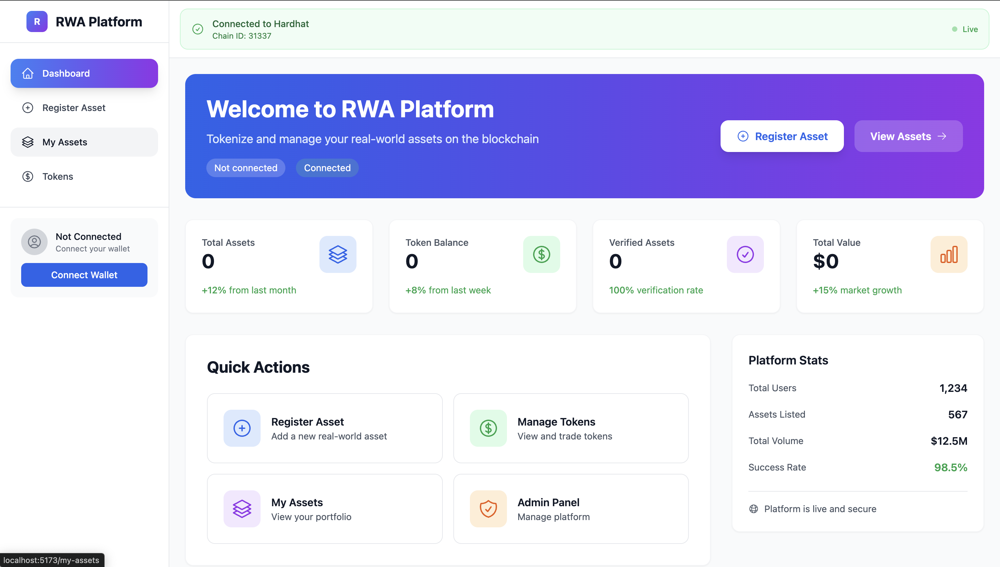
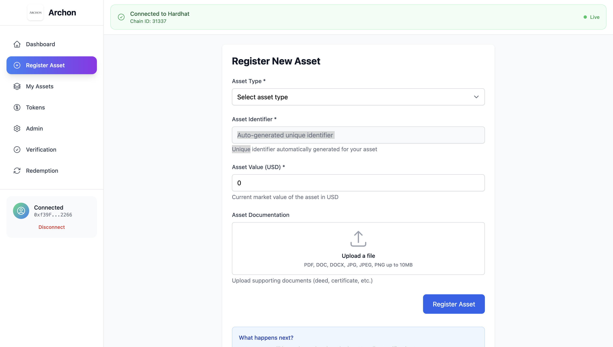
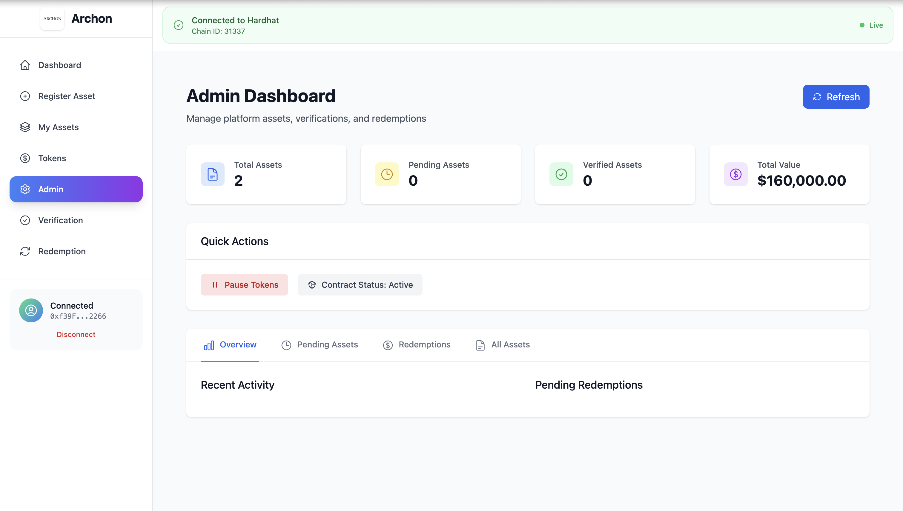
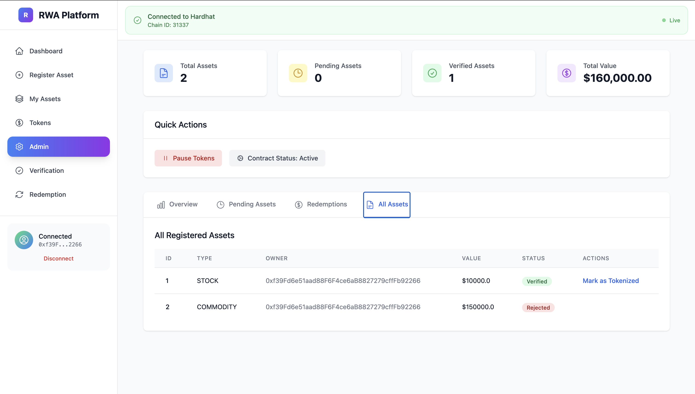
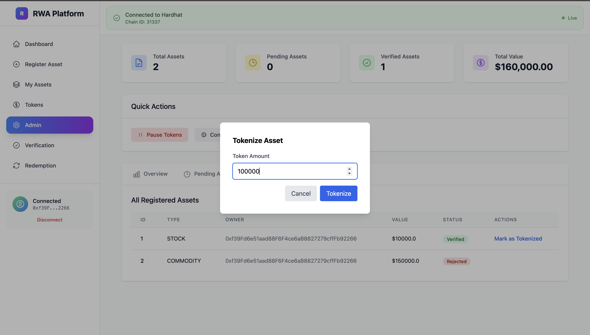
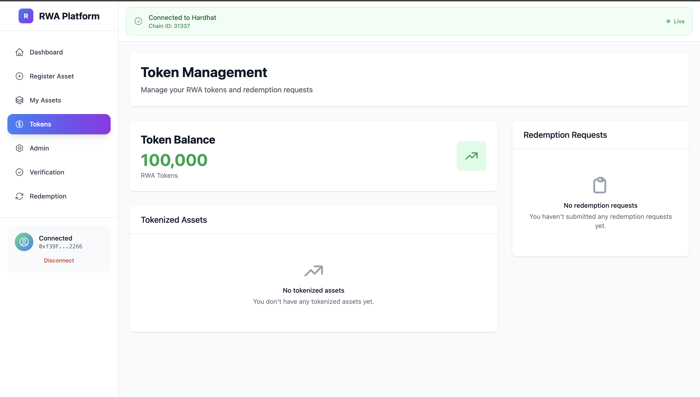

# Archon - Real-World Asset (RWA) Tokenization Platform

A comprehensive DeFi platform for tokenizing real-world assets with identity verification, asset management, and redemption capabilities. Features role-based access control, automated deployment, and a modern React frontend.

## ✨ Features

- **🔐 Role-Based Access Control**: ADMIN, VERIFIER, and MINTER roles with granular permissions
- **🏠 Asset Tokenization**: Convert real-world assets into tradeable tokens
- **👤 Identity Verification**: KYC and identity management system
- **💰 Admin Tokenization**: Admins can specify custom token amounts during asset tokenization
- **🔄 Automated Deployment**: One-command setup with automatic role grants and frontend sync
- **📱 Modern UI**: React frontend with Tailwind CSS and responsive design
- **🔗 Web3 Integration**: MetaMask wallet connection with real-time account switching
- **⚡ Real-Time Updates**: Wallet state updates immediately on account/network changes

## 📸 Screenshots

### Main Dashboard

*Modern dashboard with hero section, stats cards, and quick actions*

### Asset Registration

*User-friendly asset registration form with auto-generated unique asset IDs*

### Admin Dashboard

*Admin panel with asset verification, tokenization controls, and management tools*

### Admin Asset Management

*Complete asset overview with verification status and management options*

### Tokenization Process

*Admin tokenization modal with custom token amount selection*

### Token Dashboard

*Token management interface for tracking and managing RWA tokens*

## 🚀 Quick Start

### Prerequisites
- Node.js v18+ 
- MetaMask browser extension
- Git

### Installation
```bash
# Clone the repository
git clone <repository-url>
cd Archon

# Install dependencies
npm install
cd frontend && npm install && cd ..
```

### Automated Deployment & Setup

The platform includes fully automated scripts for deployment and configuration:

#### 1. Start Hardhat Node
```bash
npm run start
# or
npx hardhat node
```

#### 2. Deploy Contracts & Setup Everything (One Command)
```bash
npm run deploy:setup
```
This command automatically:
- ✅ Deploys all smart contracts
- ✅ Grants ADMIN_ROLE to AssetManager on AssetRegistry
- ✅ Grants MINTER_ROLE to AssetManager on RwaToken  
- ✅ Grants ADMIN_ROLE to AssetManager on RwaToken
- ✅ Updates frontend contract addresses and ABIs
- ✅ Configures the complete system ready for use

#### 3. Start Frontend
```bash
npm run frontend
# or
cd frontend && npm run dev
```

#### 4. Connect MetaMask
- Network: `Hardhat Localhost`
- RPC URL: `http://127.0.0.1:8545`
- Chain ID: `31337`
- Currency: `ETH`

## 📋 Available Commands

| Command | Description |
|---------|-------------|
| `npm run start` | Start Hardhat localhost node |
| `npm run deploy` | Deploy contracts only |
| `npm run deploy:setup` | Deploy contracts + setup permissions + update frontend |
| `npm run update-frontend` | Update frontend contract files (ABIs + addresses) |
| `npm run frontend` | Start frontend development server |
| `npx hardhat test` | Run all tests |
| `npx hardhat node` | Start local blockchain |

## 🏗️ Architecture

### Smart Contracts
- **IdentityRegistry**: KYC and identity management with role-based access
- **AssetRegistry**: Asset registration and verification with ADMIN_ROLE controls
- **RwaToken**: ERC20 token for RWA representation with MINTER_ROLE and ADMIN_ROLE
- **AssetManager**: Business logic and asset lifecycle management with custom tokenization

### Frontend
- **React + TypeScript**: Modern UI framework with type safety
- **Vite**: Fast build tool and development server
- **Tailwind CSS**: Utility-first styling with responsive design
- **Ethers.js**: Web3 integration with real-time wallet state
- **React Router v6**: Client-side navigation with protected routes
- **Context API**: Global state management for Web3 connection

## 🔐 Role-Based Access Control

The platform implements granular role-based permissions:

### Roles
- **ADMIN_ROLE**: Full system control, can grant/revoke roles, manage assets
- **VERIFIER_ROLE**: Can verify and approve asset registrations
- **MINTER_ROLE**: Can mint new tokens during asset tokenization

### Permission Flow
1. **Asset Registration**: Users register real-world assets
2. **Verification**: VERIFIER_ROLE holders verify asset details
3. **Tokenization**: ADMIN_ROLE holders can tokenize with custom amounts
4. **Trading**: Tokens become tradeable on secondary markets
5. **Redemption**: Token holders can redeem for underlying assets

## 🔄 Automated Workflow

The platform includes intelligent automation that handles:

1. **Smart Contract Deployment**: All contracts deployed with proper initialization
2. **Role Setup**: Automatic role grants between contracts for seamless operation
3. **Frontend Synchronization**: 
   - Copies latest contract ABIs
   - Updates contract addresses
   - Ensures frontend-backend consistency
4. **Permission Management**: No manual role configuration needed

### Manual Updates
If you need to update frontend files manually:
```bash
npm run update-frontend
```

## 🧪 Testing

Run comprehensive tests:
```bash
npx hardhat test
```

Tests cover:
- Contract deployment and initialization
- Role management and permissions
- Asset registration and verification
- Token minting and transfers with custom amounts
- Redemption workflows
- Edge cases and error conditions
- Access control validation

## 🌐 Network Configuration

### Local Development
- **Network**: Hardhat Localhost
- **RPC URL**: `http://127.0.0.1:8545`
- **Chain ID**: `31337`
- **Currency**: ETH

### Test Accounts
Import these private keys into MetaMask for testing:
```
0xac0974bec39a17e36ba4a6b4d238ff944bacb478cbed5efcae784d7bf4f2ff80
0x59c6995e998f97a5a0044966f0945389dc9e86dae88c7a8412f4603b6b78690d
0x5de4111afa1a4b94908f83103eb1f1706367c2e68ca870fc3fb9a804cdab365a
```

## 📁 Project Structure

```
Archon/
├── contracts/           # Smart contracts
│   ├── IdentityRegistry.sol
│   ├── AssetRegistry.sol
│   ├── RwaToken.sol
│   └── AssetManager.sol
├── scripts/            # Deployment and utility scripts
│   ├── deploy.ts       # Main deployment script
│   ├── updateFrontend.ts
│   └── grantRoles.ts   # Role management scripts
├── test/              # Test files
├── frontend/          # React frontend
│   ├── src/
│   │   ├── contracts/ # Auto-generated contract files
│   │   ├── components/
│   │   │   ├── WalletConnector.tsx
│   │   │   └── AssetCard.tsx
│   │   ├── pages/
│   │   │   ├── AdminDashboard.tsx
│   │   │   ├── AssetDetails.tsx
│   │   │   └── MyAssets.tsx
│   │   ├── contexts/
│   │   │   └── Web3Context.tsx
│   │   └── App.tsx
│   └── package.json
└── artifacts/         # Compiled contracts
```

## 🔧 Development

### Adding New Contracts
1. Add contract to `contracts/`
2. Update `scripts/updateFrontend.ts` with contract name
3. Deploy with `npm run deploy:setup`

### Frontend Development
1. Start Hardhat node: `npm run start`
2. Deploy contracts: `npm run deploy:setup`
3. Start frontend: `npm run frontend`
4. Connect MetaMask to localhost:8545

### Role Management
The system automatically handles role grants during deployment. For manual role management:
```bash
# Grant VERIFIER_ROLE to an account
npx hardhat run scripts/grantVerifierRole.ts --network localhost

# Grant ADMIN_ROLE to AssetManager
npx hardhat run scripts/grantAdminRoleToManager.ts --network localhost
```

## 🚨 Troubleshooting

### Frontend Shows Blank Page
1. Check browser console for errors
2. Verify contract addresses in `frontend/src/contracts/addresses.json`
3. Ensure ABIs are copied to `frontend/src/contracts/`
4. Restart frontend dev server
5. Hard refresh browser (Cmd+Shift+R)

### Contract Deployment Issues
1. Ensure Hardhat node is running
2. Check for sufficient ETH balance
3. Verify contract compilation: `npx hardhat compile`

### MetaMask Connection Issues
1. Add Hardhat localhost network manually
2. Import test account with private key
3. Ensure network is selected in MetaMask
4. Check that wallet state updates on account switch

### Permission Errors
1. Ensure roles are properly granted (automatic with `npm run deploy:setup`)
2. Check that you're using the correct account for your role
3. Verify contract addresses are up to date

## 📄 License

ISC License

## 🤝 Contributing

1. Fork the repository
2. Create feature branch
3. Make changes
4. Run tests
5. Submit pull request

## 🔮 Roadmap

- [ ] Multi-chain support
- [ ] Advanced asset verification workflows
- [ ] Integration with external KYC providers
- [ ] Mobile app development
- [ ] Advanced analytics dashboard
- [ ] Automated compliance reporting
