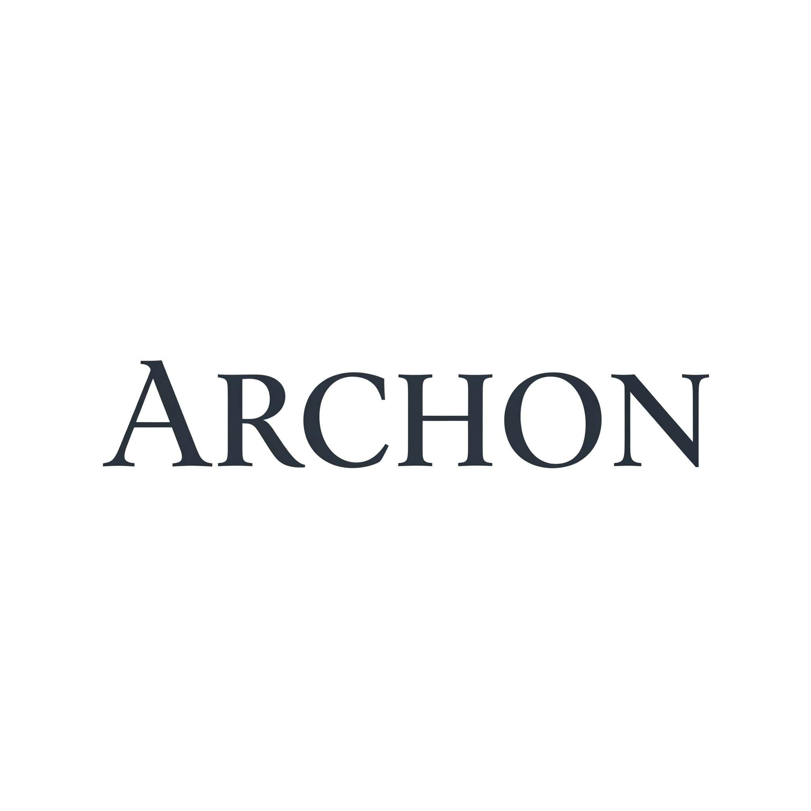
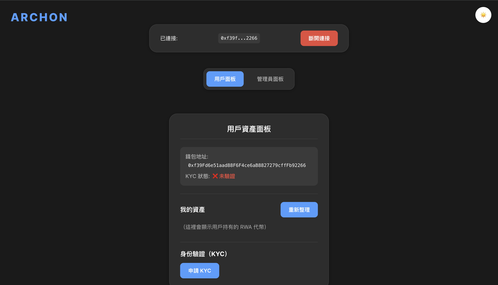
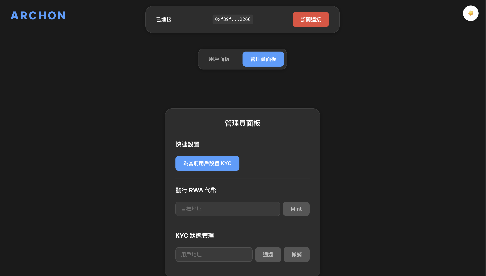

<!-- LOGO -->
<p align="center">
  
</p>

<h1 align="center">Archon RWA Tokenization DApp</h1>

<p align="center">
  
  
</p>

---

## 📝 專案簡介 | Project Overview

Archon 是一個現代化的全端 DApp，專為真實世界資產（RWA）上鏈、KYC 驗證與合規轉帳而設計。前端採用 React + styled-components，後端為 Hardhat Solidity 智能合約，支援深色/淺色主題、toast 通知、響應式設計與設計系統。

Archon is a modern full-stack DApp for Real World Asset (RWA) tokenization, KYC compliance, and secure transfer. The frontend uses React + styled-components, the backend is Hardhat Solidity smart contracts. Features include dark/light theme, toast notifications, responsive design, and a design system.

---

## ✨ 特色功能 | Features

- **KYC 驗證**：僅管理員可設置/撤銷用戶 KYC 狀態。
- **RWA NFT 發行**：管理員可發行 ERC721 代幣給指定地址。
- **合規轉帳**：僅 KYC 通過者可收/轉 NFT。
- **現代化前端**：深色/淺色主題切換、toast 通知、設計系統、響應式設計。
- **全局通知**：所有操作皆有即時 toast 提示。
- **設計系統**：統一 UI 元件，維護與擴展更容易。
- **Responsive**：手機、桌機皆有良好體驗。

- **KYC Verification**: Only admin can set/revoke user KYC status.
- **RWA NFT Minting**: Admin can mint ERC721 tokens to any address.
- **Compliant Transfer**: Only KYC-passed users can transfer/receive NFTs.
- **Modern UI**: Dark/light theme, toast notifications, design system, responsive.
- **Global Toasts**: All actions have instant feedback.
- **Design System**: Unified UI components for easy maintenance.
- **Responsive**: Great on both mobile and desktop.

---

## 🛠 技術棧 | Tech Stack

- **智能合約 | Smart Contract**：Solidity, Hardhat
- **前端 | Frontend**：React, Vite, styled-components, ethers.js
- **UI/UX**：設計系統、主題切換、全局 toast、響應式設計

---

## 🚀 安裝與啟動 | Getting Started

### 1. 啟動 Hardhat 本地區塊鏈 | Start Hardhat Local Node
```sh
cd backend # 或合約目錄 | or contract dir
npm install
npx hardhat node
```

### 2. 部署智能合約 | Deploy Contracts
（另開一個終端機 | new terminal）
```sh
npx hardhat run scripts/deploy.ts --network localhost
```

### 3. 啟動前端 | Start Frontend
```sh
cd frontend
npm install
npm run dev
```

### 4. 連接錢包 | Connect Wallet
- 使用 MetaMask 新增本地網路（http://127.0.0.1:8545）
- 匯入 Hardhat node 顯示的私鑰
- 進入前端網址（如 http://localhost:5173）

---

## 📖 使用說明 | Usage
- **管理員面板**：設置用戶 KYC、發行 NFT
- **用戶面板**：查看資產、KYC 狀態、嘗試轉帳
- **錢包連接**：支援 MetaMask，切換帳號測試不同角色
- **通知與驗證**：所有操作有即時 toast 提示，表單有格式驗證

- **Admin Panel**: Set user KYC, mint NFT
- **User Panel**: View assets, KYC status, transfer tokens
- **Wallet Connect**: MetaMask support, switch accounts for role testing
- **Toasts & Validation**: All actions have instant feedback, forms are validated

---

## ❓ 常見問題 | FAQ
- **合約地址不符**：請確認前端設定與部署地址一致
- **端口衝突**：Hardhat 預設 8545，Vite 預設 5173
- **權限問題**：請用 Hardhat node 給的帳號測試
- **KYC 限制**：未通過 KYC 無法收/轉 NFT

- **Contract address mismatch**: Make sure frontend config matches deployed address
- **Port conflict**: Hardhat uses 8545, Vite uses 5173
- **Permission issues**: Use accounts provided by Hardhat node
- **KYC restriction**: Only KYC-passed users can transfer/receive NFTs

---

## 📬 聯絡方式 | Contact
如有問題，請開 issue 或聯絡專案擁有者。
If you have questions, open an issue or contact the project owner.
